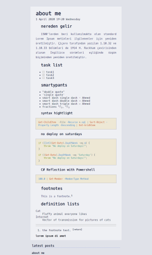

Hacker

[Live Demo](https://guneysus.gohugo.io/gohugo-hacker)

## Installation

In your Hugo site `themes` directory, run:

```
git clone https://github.com/guneysus/gohugo-hacker themes/hacker
```

Next, open `config.toml` in the base of the Hugo site and ensure the theme option is set to `hacker`.

```
theme = "hacker"
```

And define a color scheme in params section

```toml
[params]
    colorScheme = "default"
  # colorScheme = "ubuntu"
  # colorScheme = "monochrome-dark"
  # colorScheme = "monochrome-light"
  # colorScheme = "xterm"
  # colorScheme = "ubuntu"
  # colorScheme = "alexpate-2"
  # colorScheme = "alexpate-3"
  # colorScheme = "alexpate-15"
  # colorScheme = "alexpate-20"
  # colorScheme = "alexpate-26"
  # colorScheme = "alexpate-31"
  # colorScheme = "alexpate-34"
  # colorScheme = "alexpate-42"
  # colorScheme = "alexpate-54"
  # colorScheme = "alexpate-65"
  # colorScheme = "alexpate-72"
  # colorScheme = "alexpate-91"
  # colorScheme = "alexpate-96"
```

## Theme Previews

### alexpate-15 
[](images/alexpate-15.png)

### alexpate-2 
[](images/alexpate-2.png)

### alexpate-20 
[](images/alexpate-20.png)

### alexpate-26 
[](images/alexpate-26.png)

### alexpate-3 
[](images/alexpate-3.png)

### alexpate-31 
[](images/alexpate-31.png)

### alexpate-34 
[](images/alexpate-34.png)

### alexpate-42 
[](images/alexpate-42.png)

### alexpate-54 
[](images/alexpate-54.png)

### alexpate-65 
[](images/alexpate-65.png)

### alexpate-72 
[](images/alexpate-72.png)

### alexpate-91 
[](images/alexpate-91.png)

### alexpate-96 
[](images/alexpate-96.png)

### default 
[](images/default.png)

### monochrome-dark 
[](images/monochrome-dark.png)

### monochrome-light 
[](images/monochrome-light.png)

### ubuntu 
[](images/ubuntu.png)

### xterm 
[](images/xterm.png)


## Contributing

Have you found a bug or got an idea for a new feature? Feel free to use the [issue tracker](https://github.com/guneysus/gohugo-hacker/issues) to let me know. Or make directly a [pull request](https://github.com/guneysus/gohugo-hacker/pulls).

## License

This theme is released under the [MIT license](https://github.com/guneysus/gohugo-hacker/blob/master/LICENSE).
